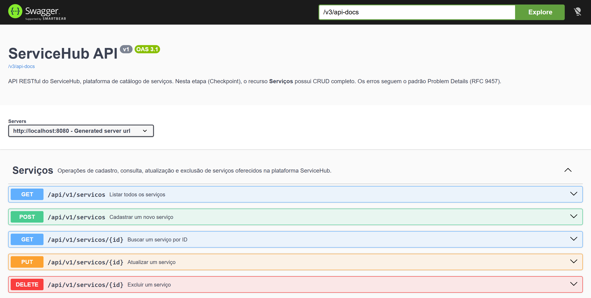
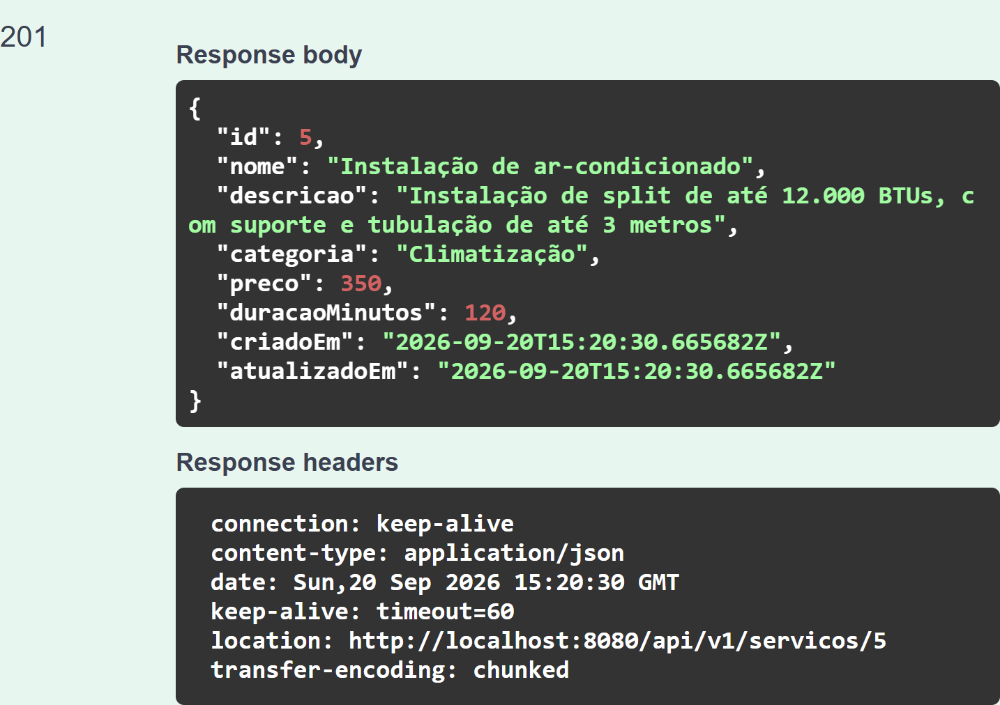

# ServiceHub API

API RESTful do **ServiceHub**, uma plataforma de catálogo de serviços. Esta entrega (Checkpoint) implementa o
recurso **Serviços** com CRUD completo, persistência em PostgreSQL e documentação interativa com Swagger/OpenAPI.

> Projeto da disciplina de Engenharia de Software (6º período) — desenvolvimento de APIs RESTful com Java e Spring Boot.

## Tecnologias

| Tecnologia | Uso |
|---|---|
| Java 21 | Linguagem |
| Spring Boot 3.5 | Framework base |
| Spring Web | Camada REST (controllers) |
| Spring Data JPA / Hibernate | Persistência e repositórios |
| PostgreSQL 16 | Banco de dados |
| Flyway | Migrations do esquema do banco |
| Bean Validation | Validação dos dados de entrada |
| SpringDoc OpenAPI 2.8 | Geração do OpenAPI e do Swagger UI |
| JUnit 5, MockMvc, Mockito, H2 | Testes automatizados |
| Maven (com Maven Wrapper) | Build e dependências |

## Arquitetura

```
Controller  ->  Service  ->  Repository  ->  PostgreSQL
 (HTTP/REST)   (regras)      (Spring Data)      (tabela servicos)
      \            |
       DTOs (ServicoRequest / ServicoResponse) + Entity (Servico)
```

```
src/main/java/com/servicehub/api
├── controller/   ServicoController        (rotas REST + anotações OpenAPI)
├── service/      ServicoService           (regras de negócio e transações)
├── repository/   ServicoRepository        (JpaRepository)
├── entity/       Servico                  (entidade JPA)
├── dto/          ServicoRequest/Response  (contratos da API + validações)
├── exception/    GlobalExceptionHandler   (@RestControllerAdvice, Problem Details)
└── config/       OpenApiConfig
src/main/resources/db/migration/V1__criar_tabela_servicos.sql
```

## Pré-requisitos

- **JDK 21** (`java -version`)
- **PostgreSQL 16** (instalado localmente **ou** via Docker Compose, veja abaixo)
- Não é necessário instalar o Maven: o projeto inclui o Maven Wrapper (`mvnw` / `mvnw.cmd`).

## Configurando o banco de dados

A aplicação lê a conexão de **variáveis de ambiente** (nenhuma senha fica no código):

| Variável | Padrão | Descrição |
|---|---|---|
| `DB_URL` | `jdbc:postgresql://localhost:5432/servicehub` | URL JDBC |
| `DB_USER` | `servicehub` | Usuário |
| `DB_PASSWORD` | *(sem padrão — obrigatória)* | Senha |

### Opção A — Docker Compose (recomendada para desenvolvimento)

```bash
cp .env.example .env        # edite o .env e defina DB_PASSWORD
docker compose up -d
```

O Compose cria o banco `servicehub` com o usuário e a senha definidos no `.env`.

> Nota: o `docker-compose.yml` foi escrito seguindo a documentação oficial da imagem `postgres`, mas **não foi
> executado** no ambiente em que o projeto foi desenvolvido (sem Docker). A validação com PostgreSQL foi feita
> com um servidor PostgreSQL 16.4 local.

### Opção B — PostgreSQL já instalado

```sql
CREATE DATABASE servicehub;
```

### Definindo as variáveis e executando

PowerShell:

```powershell
$env:DB_USER = "servicehub"
$env:DB_PASSWORD = "sua-senha"
.\mvnw.cmd spring-boot:run
```

Linux / macOS / Git Bash:

```bash
export DB_USER=servicehub
export DB_PASSWORD=sua-senha
./mvnw spring-boot:run
```

Na primeira execução o **Flyway** cria a tabela `servicos` automaticamente. O Hibernate apenas **valida** o esquema
(`ddl-auto=validate`).

## Swagger / OpenAPI

Com a aplicação rodando:

- Swagger UI: <http://localhost:8080/swagger-ui.html> (redireciona para `/swagger-ui/index.html`)
- Especificação OpenAPI (JSON): <http://localhost:8080/v3/api-docs>



Resposta real de um `POST /api/v1/servicos` executado pelo próprio Swagger UI (*Try it out* → *Execute*):



Todos os endpoints possuem `@Operation` (summary e description), `@ApiResponse` para os códigos HTTP retornados e
os DTOs possuem `@Schema` com descrições e exemplos.

## Recurso `Serviço`

| Campo | Tipo | Regras |
|---|---|---|
| `id` | Long | Gerado pelo banco |
| `nome` | String | Obrigatório, 3 a 100 caracteres |
| `descricao` | String | Opcional, até 500 caracteres |
| `categoria` | String | Obrigatória, até 60 caracteres |
| `preco` | Decimal | Obrigatório, > 0, até 2 casas decimais |
| `duracaoMinutos` | Inteiro | Obrigatório, >= 1 |
| `criadoEm` / `atualizadoEm` | Data/hora (UTC) | Geradas pela API |

## Endpoints

| Método | Rota | Descrição | Sucesso | Erros |
|---|---|---|---|---|
| `POST` | `/api/v1/servicos` | Cadastrar serviço | `201 Created` (+ `Location`) | `400` |
| `GET` | `/api/v1/servicos` | Listar todos | `200 OK` | — |
| `GET` | `/api/v1/servicos/{id}` | Buscar por ID | `200 OK` | `400` (ID não numérico), `404` |
| `PUT` | `/api/v1/servicos/{id}` | Atualizar (substituição completa) | `200 OK` | `400`, `404` |
| `DELETE` | `/api/v1/servicos/{id}` | Excluir | `204 No Content` | `400`, `404` |

Decisões de design:

- **PUT** substitui o recurso inteiro: o corpo deve trazer todos os campos obrigatórios e uma `descricao` omitida
  é limpa. A data de criação é preservada e `atualizadoEm` é renovada.
- Os erros seguem o padrão **Problem Details (RFC 9457)**, com `Content-Type: application/problem+json`, e as
  mensagens estão em português. Erros de validação trazem a lista `erros` com `campo` e `mensagem`.
- Rotas inexistentes retornam `404` e métodos não suportados retornam `405` (com o cabeçalho `Allow`).

## Exemplos de requisições

Respostas abaixo obtidas em execução real contra o PostgreSQL (trechos; cabeçalhos irrelevantes omitidos).

**Criar — `201 Created`**

```bash
curl -i -X POST http://localhost:8080/api/v1/servicos \
  -H "Content-Type: application/json" \
  -d '{"nome":"Limpeza residencial","categoria":"Limpeza","preco":120.50,"duracaoMinutos":180}'
```

```http
HTTP/1.1 201
Location: http://localhost:8080/api/v1/servicos/2
Content-Type: application/json

{"id":2,"nome":"Limpeza residencial","descricao":null,"categoria":"Limpeza","preco":120.50,"duracaoMinutos":180,"criadoEm":"2026-09-20T15:08:24.325098Z","atualizadoEm":"2026-09-20T15:08:24.325098Z"}
```

**Buscar por ID — `200 OK`** · `curl -i http://localhost:8080/api/v1/servicos/1`

**Listar — `200 OK`** · `curl -i http://localhost:8080/api/v1/servicos`

**Atualizar — `200 OK`**

```bash
curl -i -X PUT http://localhost:8080/api/v1/servicos/1 \
  -H "Content-Type: application/json" \
  -d '{"nome":"Split 18.000 BTUs","categoria":"Climatização","preco":480.00,"duracaoMinutos":150}'
```

**Excluir — `204 No Content`** · `curl -i -X DELETE http://localhost:8080/api/v1/servicos/2`

**Dados inválidos — `400 Bad Request`** (`POST` com `{}`)

```json
{
  "type": "about:blank",
  "title": "Dados inválidos",
  "status": 400,
  "detail": "Um ou mais campos são inválidos",
  "instance": "/api/v1/servicos",
  "erros": [
    { "campo": "nome", "mensagem": "O nome é obrigatório" },
    { "campo": "duracaoMinutos", "mensagem": "A duração estimada é obrigatória" },
    { "campo": "categoria", "mensagem": "A categoria é obrigatória" },
    { "campo": "preco", "mensagem": "O preço é obrigatório" }
  ]
}
```

**Não encontrado — `404 Not Found`** (`GET /api/v1/servicos/99`)

```json
{
  "type": "about:blank",
  "title": "Recurso não encontrado",
  "status": 404,
  "detail": "Serviço com id 99 não encontrado",
  "instance": "/api/v1/servicos/99"
}
```

> **Dica para Windows:** no Git Bash, o `curl` pode enviar caracteres acentuados em outra codificação e
> a API responderá `400`. Salve o JSON em um arquivo UTF-8 e envie com `--data-binary @arquivo.json`, ou use o
> Swagger UI.

## Testes

```bash
./mvnw test          # Windows: .\mvnw.cmd test
```

Os testes **não precisam de PostgreSQL nem de Docker**: usam o perfil `test`, com banco **H2 em memória** (modo
PostgreSQL). O Flyway executa a mesma migration e o Hibernate valida o esquema.

| Classe | Tipo | Cobertura |
|---|---|---|
| `ServicoControllerTest` | Integração (MockMvc + banco) | CRUD completo, `201/200/204/400/404/405/415`, validações, formato dos erros e presença de summary/description no OpenAPI |
| `ServicoServiceTest` | Unitário (Mockito) | Normalização de texto e exceções de recurso inexistente |

Resultado da última execução: **27 testes, 0 falhas, 0 erros, 0 ignorados**.

## Limitações conhecidas

- Sem autenticação/autorização (previsto para a entrega final).
- A listagem não é paginada e não possui filtros.
- Os testes automatizados usam H2; o comportamento com PostgreSQL foi verificado manualmente (aplicação em
  execução, chamadas HTTP e consultas SQL diretas).
- O `docker-compose.yml` não foi executado no ambiente de desenvolvimento (sem Docker instalado).
